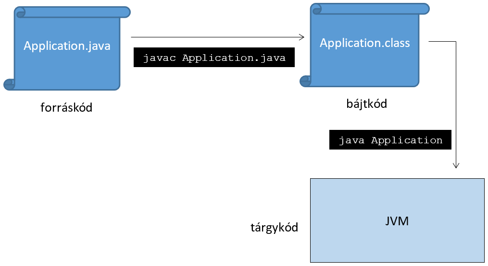

class: inverse, center, middle

# Java platform

---

# Mi kell a Javához?

Futtatáshoz:
* JRE (Java Runtime Environment):
  JVM (Java Virtual Machine) + osztálykönyvtárak
  (Java 11-től megszűnt)
Fejlesztéshez:
* JDK (Java Development Kit):
  JRE + fejlesztőeszközök (pl. compiler)

---

# Fejlesztés menete

